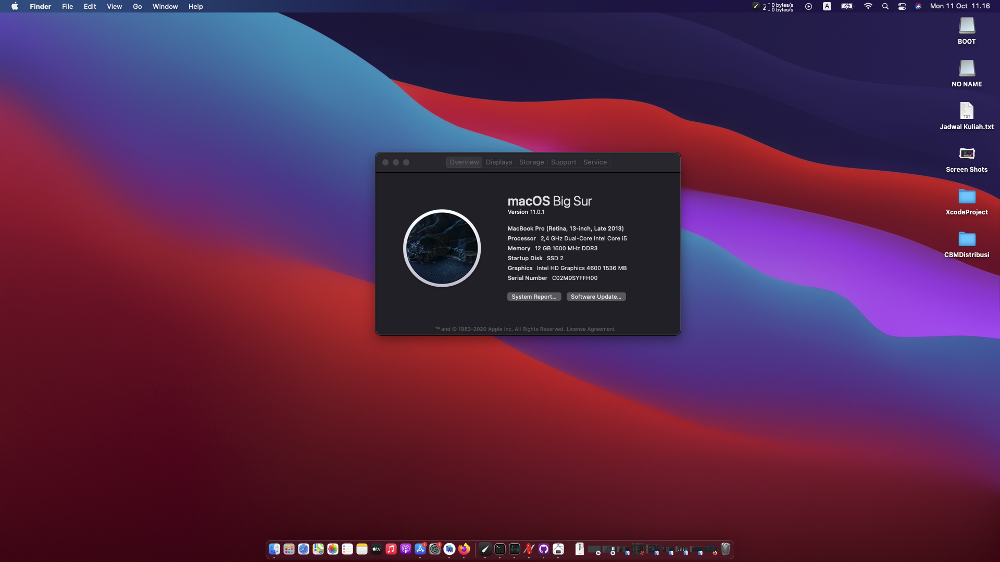
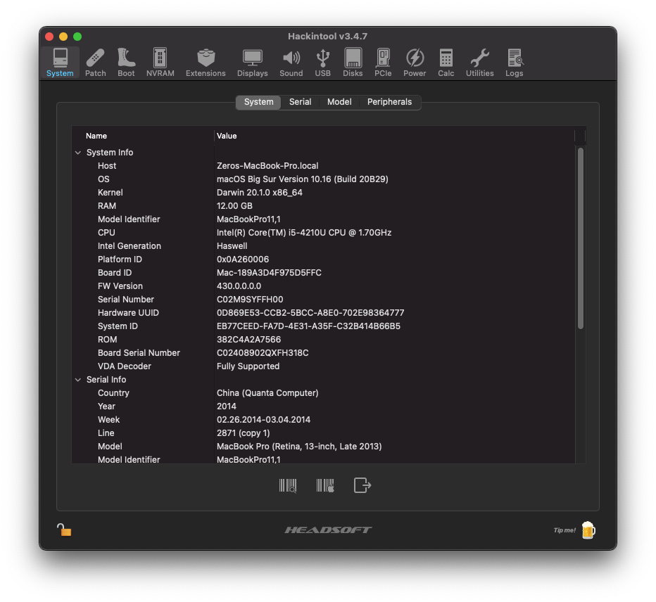
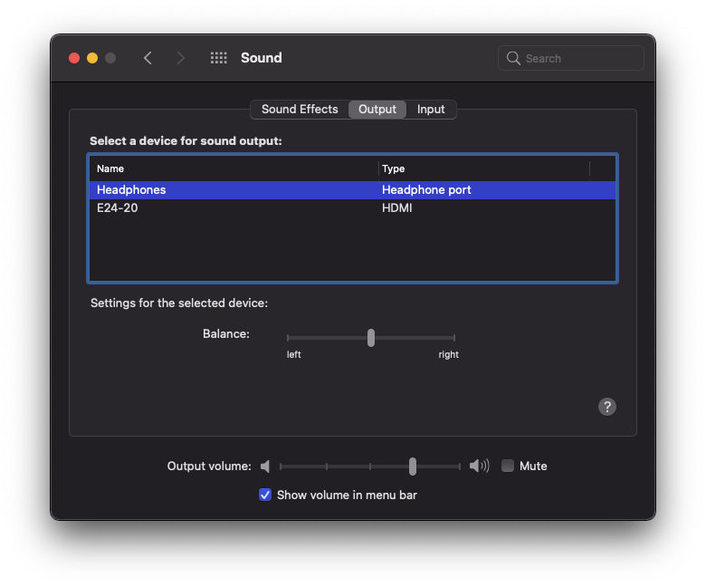

    <a href="#">
          

    </a>
  

    MacOs Big Sur on Asus X552L Laptop with OpenCore bootloader (hackintosh Big Sur) 

Screenshot

System Hackintool

Extensions Hackintool

Network

Battery

Sound

